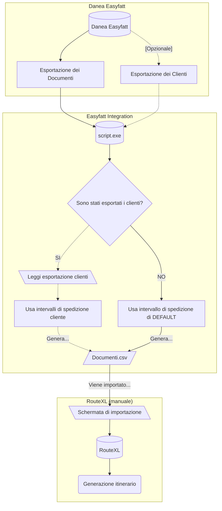

# Integrazione con RouteXL
{: .no_toc}

  

    Table of contents
  

  {: .text-delta }
1. TOC
{:toc}

## Cos'è RouteXL?
[**RouteXL**](https://www.routexl.it/) è un pianificatore di itinerari stradali verso destinazioni multiple.

Tramite un algoritmo intelligente permette di ordinare gli indirizzi in modo da **minimizzare la durata** totale del percorso.

## Come avviene l'integrazione?
Il programma rilascia un file CSV, il cui contenuto andrà poi incollato nella finestra di importazione di .

Di seguito uno schema esplicativo:

## Lettura degli ordini in uscita
Il programma ha bisogno di un elenco di ordini da effettuare in formato `.DefXml` per poter funzionare.

Per generarlo:
1. Andare nella sezione "_Documenti > **Ordini cliente**_"
2. Selezionare tutti gli **ordini** da effettuare in una **singola spedizione**.
3. Cliccare su "_Utilità_" e successivamente su "_Esporta documenti Easyfatt-Xml_"
4. **Salvare** il file nella **stessa cartella** in cui si trova anche l'eseguibile.

## [Extra] Gestione degli orari di consegna
Il programma permette la gestione degli orari di consegna per ogni singolo cliente.
> _Ad esempio:_
> _Mario Rossi accetta consegne dalle 10:00 alle 15:00, mentre Bianchi S.P.A. accetta consegne dalle 09:00 alle 18:00_
{: .highlight}

Questo però è possibile solo se nella cartella in cui si trova l'eseguibile è **presente** anche il **file** *`ExportClienti.xlsx`* ([**qui**](#come-generare-il-file-exportclientixlsx) la guida su come generarlo) e:
1. TUTTI i clienti hanno un **Codice cliente**
1. E' definita la colonna **`Extra 1`** (_ossia il campo "Libero 1"_)

**Come si fa quindi a generare il file `ExportClienti.xlsx`?**
{: .text-center .text-purple-300}

> Affinchè il file generato risulti **valido** bisognerà **obbligatoriamente** seguire i seguenti passi:
> 1. Definire e **valorizzare** correttamente il campo "Intervallo consegne" per ogni > cliente
> 1. Controllare che ogni cliente abbia un proprio "**Codice cliente**" univoco.
> 1. **Esportare** tutti i clienti in **XLSX**
{: .warning}

### 1. Definire il campo "Intervallo consegne"
1. Andare nella scheda **"Cliente"**.
1. Per ogni Cliente definire un **valore valido** all'interno del campo personalizzato "_**Varie > Libero 1**_"

> E' possibile **rinominare** il campo "_Libero 1_" per una **miglior leggibilità** (ad esempio "Orario consegne" o "Intervalli di consegna").
> 
> Il nome infatti non è importante, in quanto in fase di export verrà **sempre** salvato come "**Extra N**" (dove N è il numero del campo).
>
> Per rinominarlo andare su "_Opzioni > Clienti e Fornitori > Nomi campi aggiuntivi_".
{: .note}

> Valori validi
> 
> Al momento sono considerati valori validi:
> 1. **`HH > HH`**
> 1. **`H >> HH`**
> 1. **`HH:MM - HH`**
> 1. **`HH:MM a HH:MM`**
>
> Nota inoltra che:
> - Gli spazi sono _necessari solo per la sintassi 4_, mentre per tutte le altre sono completamente opzionali (es. `08 >> 12:00` è identico a `08:00>>12`).
> - L'indicatore dei minuti è _sempre opzionale_; in sua assenza verrà automaticamente aggiunto `:00` (es. `08` = `08:00`)
> - Sia l'indicatore dei minuti che delle ore vengono _sempre normalizzati_ nel formato `HH:MM` (es. `8:4` = `08:04`)
{: .warning-title}

### 2. Controllare il "Codice cliente" di ogni cliente
1. Andare nella scheda **"Cliente"**.
1. Per ogni Cliente controllare che il campo "_Anagrafica > Codice_" sia **valorizzato correttamente** (_non deve essere vuoto_)

### 3. Esportare i clienti
1. Andare nella scheda **"Cliente"**.
1. Selezionare **tutti i clienti** (_consiglio: selezionare il primo e poi spuntare l'ultimo mantenendo premuto il tasto Shift_)
1. Cliccare su "_**Utilità** > **Esporta** con Excel/OpenOffice/LibreOffice_"
1. Selezionare "**Microsoft Excel**" e cliccare su OK
1. Salvare il file **nella stessa cartella** del programma

